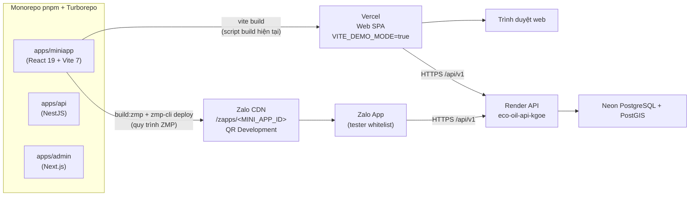
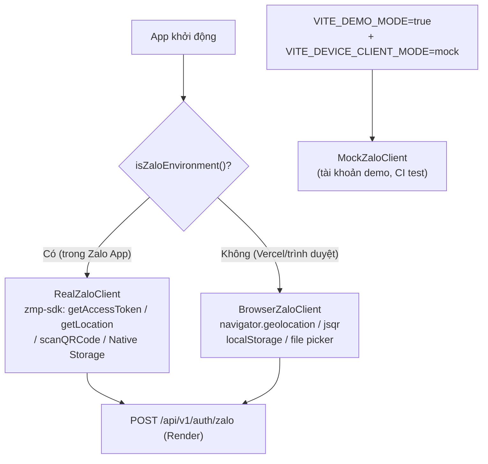
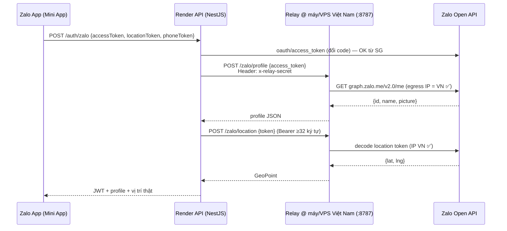

Đã thu thập đủ ngữ cảnh (codebase hiện tại + tài liệu chính thức Zalo). Dưới đây là **báo cáo kỹ thuật hoàn chỉnh** theo 4 nhiệm vụ. Lưu ý quan trọng trước khi đọc: repo hiện tại (`ui_version_3`) đã có sẵn phần lớn nền móng — adapter `native/browser/mock` trong `apps/miniapp/src/lib/zalo-client.ts`, hai relay (`ZALO_PROFILE_RELAY`, `ZALO_LOCATION_RELAY`) và quy trình ZMP cũ đã lưu trữ tại `docs/archive/` — nên báo cáo này vừa là phương án tổng quát, vừa bám sát hiện trạng để đội kỹ thuật áp dụng ngay.

---

# BÁO CÁO KỸ THUẬT: ĐƯA ECO-OIL LÊN ZALO MINI APP (DEVELOPMENT) SONG SONG WEB VERCEL

## NHIỆM VỤ 1 — Phân biệt Zalo Native SDK (iOS/Android) vs Zalo Mini App (ZMP)

### 1.1. Đây là 2 hệ sinh thái hoàn toàn khác nhau

| Tiêu chí | **Zalo Native SDK** (file đính kèm) | **Zalo Mini App (ZMP)** |
|---|---|---|
| Mục tiêu | Tích hợp vào **app native iOS/Android** bạn tự build (CocoaPods/Gradle) | App chạy **bên trong Zalo** (WebView/Super App), code bằng React/Vite |
| Cài đặt | `pod 'ZaloSDK'` / `me.zalo:sdk-core/auth/openapi` | `zmp-sdk` (npm) + `zmp-cli` |
| Cổng quản trị | `developers.zalo.me` → **App ID + App Secret** | `mini.zalo.me` (Mini App Center) → **Mini App ID** |
| Xác thực | **OAuth 2.0 + PKCE**: app tự tạo `code_verifier`/`code_challenge`, nhận `oauthCode` (10 phút), đổi lấy `accessToken` (1 giờ) + `refreshToken` (3 tháng). App tự quản lý session (SDK không lưu) | **ZMP JS SDK**: `getAccessToken()`, `getUserInfo()`, `getPhoneNumber()` (trả **token một lần**), `getLocation()` (trả **token một lần**). Backend đổi token bằng **App Secret** qua Open API |
| Callback | URL Scheme `zalo-{appId}` + `LSApplicationQueriesSchemes` / `intent-filter` | Không có — Zalo App là host, Mini App nhận QR/Deep Link |
| Ràng buộc thiết bị | iOS Bundle ID, Android Package Name + **Base64 SHA1 Sign Key** | Domain API Whitelist + Tester Whitelist trên Mini App Center |
| Dùng cho dự án này? | ❌ Không (dự án là React/Vite SPA) | ✅ Đúng nền tảng cần deploy |

### 1.2. Nhầm lẫn kinh điển cần tránh (đã từng xảy ra trong dự án)

| Nhầm lẫn | Hậu quả | Cách nhận diện đúng |
|---|---|---|
| Dán **Mini App ID** (19 chữ số, vd `2013689159096493937`) vào `ZALO_APP_ID` | Lỗi `-5000 App id is invalid` ngay khi login | App ID là số **ngắn** từ `developers.zalo.me`; Mini App ID là số **dài** từ `mini.zalo.me` |
| Tìm **App Secret** trong Mini App Center | Không có — vô ích | **Secret chỉ tồn tại ở Zalo App** (`developers.zalo.me` → Cài đặt ứng dụng → Secret Key) |
| Áp luồng **PKCE** (`code_verifier`/`code_challenge`) của Native SDK vào Mini App | Sai luồng — Mini App không dùng PKCE phía client | Mini App: client chỉ `getAccessToken()`; **backend** đổi token/verify bằng App Secret |
| Tin `zalo_id` do client tự gửi lên | Lỗ hổng giả mạo định danh | Backend phải tự gọi `graph.zalo.me/v2.0/me` bằng access token để lấy ID thật |
| Dùng `localStorage`/cookie như web thường | Mất dữ liệu trên Zalo WebView | Phải dùng **Native Storage** của ZMP (`getStorage/setStorage`) |

> **Ghi chú về mã lỗi `-501`:** Trong bảng mã lỗi của Native SDK không có `-501` — đây là mã lỗi **server-side của Zalo Open API** (khác namespace với `-5000`…`-9026` của SDK client), biểu thị request bị từ chối theo chính sách **geo-restriction** (chi tiết ở Nhiệm vụ 3).

---

## NHIỆM VỤ 2 — Deploy Zalo Mini App (Development) tách biệt Web Vercel

### 2.1. Kiến trúc tổng thể: một codebase, hai đầu ra độc lập



Nguyên tắc bất biến: **`vite build` (Vercel) và pipeline ZMP dùng chung `dist/` nhưng là 2 lệnh riêng biệt, không chồng lấn**. Vercel chỉ gọi `cd ../.. && npx turbo run build --filter=@eco-oil/miniapp` — không bao giờ chạm `zmp-cli`; ZMP chỉ chạy thủ công trên máy dev khi cần phát hành bản Development.

### 2.2. Cấu hình `app-config.json` (đặt tại `apps/miniapp/app-config.json`)

Theo tài liệu chính thức, file này đặt ở **thư mục gốc project ZMP** (tức `apps/miniapp/`) và chỉ chứa cấu hình giao diện + tài nguyên:

```json
{
  "app": {
    "title": "ECOllect",
    "headerTitle": { "vi": "ECOllect", "en": "ECOllect" },
    "headerColor": { "light": "#1b6d24", "dark": "#0b3d12" },
    "textColor": "white",
    "leftButton": "back",
    "statusBar": "normal",
    "actionBarHidden": false,
    "selfControlLoading": false
  },
  "listSyncJS": ["assets/index.module.js"],
  "listAsyncJS": [],
  "listCSS": ["assets/index.css"]
}
```

> Lưu ý tương thích với `vite.config.ts` hiện tại: `entryFileNames: 'assets/[name].module.js'` và `assetFileNames: 'assets/[name][extname]'` đã được cấu hình **đúng chuẩn ZMP** từ trước (theo `docs/archive/zalo-integration-handoff.md`: `base: './'`, chunk `.module.js` khớp `listSyncJS`). Ngoài ra ZMP yêu cầu root element là `<div id="app">` thay vì `id="root"` của web — đây là 1 trong 2 điểm duy nhất cần hài hòa (xem 2.5).

### 2.3. Scripts `package.json` không xung đột Vercel

Khôi phục quy trình đã lưu trữ (theo `docs/archive/ZALO_DEV_SETUP.md` — quy trình này **đã chạy thành công trước đây**, chỉ bị gỡ khi tập trung Web Demo):

```jsonc
// apps/miniapp/package.json
{
  "scripts": {
    "dev": "vite --host 0.0.0.0",
    "build": "tsc -b && vite build",          // ← Vercel CHỈ dùng lệnh này, không đổi
    "build:zmp": "vite build --mode zmp",      // ← pipeline Zalo, tách biệt
    "deploy:zmp": "zmp-cli deploy --existing --outputDir dist",
    "lint": "eslint \"src/**/*.{ts,tsx}\"",
    "typecheck": "tsc --noEmit"
  },
  "devDependencies": {
    "zmp-cli": "4.0.3"  // pin version, tránh drift
  }
}
```

Điểm then chốt đã được kiểm chứng trong repo (DEMO_RUNBOOK): **`zmp start` không dùng được cho repo này** (CLI không nhận đây là project ZMP chuẩn do monorepo) → luôn dùng cặp `build:zmp` + `deploy --existing --outputDir dist`. Lệnh `deploy --existing` cho phép dùng thư mục `dist/` do Vite tự build mà không cần CLI build lại.

```bash
# Quy trình deploy bản Development (chạy thủ công trên máy dev, KHÔNG chạy trên CI/Vercel)
pnpm --filter @eco-oil/miniapp build:zmp
pnpm --filter @eco-oil/miniapp exec zmp-cli login        # quét QR bằng Zalo (tk Admin/Developer)
pnpm --filter @eco-oil/miniapp exec zmp-cli deploy --existing --outputDir dist
# CLI hỏi: Project → Mini App ID → Version status (chọn Development) → Description
# Kết quả: QR Code + Deep Link bản Development
```

### 2.4. Các bước trên Mini App Center (`mini.zalo.me`)

**Checklist thiết lập (một lần):**
- [ ] Đăng nhập `mini.zalo.me` bằng tài khoản Zalo chủ dự án.
- [ ] Chọn Zalo App đã tạo ở `developers.zalo.me` → **Tạo Mini App** → ghi lại **Mini App ID** (19 chữ số).
- [ ] Vào **Cài đặt → Thành viên/Tester**: thêm số điện thoại tester nội bộ vào whitelist. *Thiếu bước này → tester nhận lỗi `-6001 Invalid Permission (not in white list)` khi mở app.*
- [ ] Vào **Cài đặt → Tên miền/Domain API Whitelist**: khai báo `https://eco-oil-api-kgoe.onrender.com` (và origin staging nếu tách). Mini App chạy trên host `h5.zdn.vn` — mọi `fetch` tới domain không whitelist sẽ bị chặn ở tầng WebView.
- [ ] Xin cấp quyền (nếu dùng): `scope.user_location`, `scope.user_phonenumber`, camera/quét QR, Native Storage — mỗi quyền cần mô tả lý do. Ở trạng thái Development, tester whitelist dùng được ngay không cần duyệt phát hành.
- [ ] Kiểm tra CORS phía API: `CORS_ORIGINS` trên Render phải chứa `https://h5.zdn.vn` (repo đã có trong `.env.example`).

**Checklist mỗi lần phát hành bản Development:**
- [ ] `build:zmp` thành công, `dist/` có `assets/index.module.js`.
- [ ] `zmp-cli login` còn hạn (quên login → deploy "im lặng" không lên bản mới).
- [ ] Chọn đúng **Mini App ID** (không nhầm App ID).
- [ ] Chọn loại **Development** (bị ghi đè mỗi lần deploy, không hiện trong Quản lý phiên bản — đúng nhu cầu "chỉ tester nội bộ").
- [ ] Nhập **Description** có nghĩa (quên → bản mới không lên mà không báo lỗi rõ).
- [ ] Gửi QR Development cho tester; tester **tắt hẳn app Zalo rồi mở lại** để xóa cache WebView.

### 2.5. Adapter/Strategy Pattern nhận diện môi trường — **repo đã có sẵn, chỉ cần hoàn thiện**

Đây là điểm mạnh lớn nhất của codebase: `apps/miniapp/src/lib/zalo-client.ts` đã hiện thực đúng Strategy Pattern:

```typescript
// Hiện trạng có sẵn (apps/miniapp/src/lib/zalo-client.ts)
export interface IZaloClient {
  readonly mode: 'native' | 'browser' | 'mock';
  login(): Promise<SeedAccount>;
  getAccessToken(): Promise<string>;
  getLocation(fallback?: GeoPoint | null): Promise<GeoPoint | null>;
  scanQRCode(): Promise<string>;
  chooseImage(source?: ImageSource): Promise<PhotoAsset>;
  getStorage(key: string): string | null;
  // ...
}

export function createZaloClient(mode?: DeviceClientMode): IZaloClient {
  const resolvedMode = mode ?? (isZaloEnvironment() ? 'native' : 'browser');
  if (resolvedMode === 'native') return new RealZaloClient();    // gọi zmp-sdk thật
  if (resolvedMode === 'mock')  return new MockZaloClient();     // demo/CI
  return new BrowserZaloClient();                                 // Vercel: giữ nguyên luồng web
}
```

`isZaloEnvironment()` detect bằng: ≥2 hàm native trên `window.ZaloMiniAppSDK` **hoặc** (có `APP_ID`/`zAppID` được inject + User-Agent chứa "Zalo"). Nhờ đó:



**Các điểm cần hoàn thiện khi chạy bản ZMP thật (gap list):**

| # | Hạng mục | Việc cần làm | Rủi ro cho Web Vercel |
|---|---|---|---|
| 1 | Root element | Hài hòa `index.html`: ZMP cần `<div id="app">`, web đang dùng `id="root"` → đổi chung về `id="app"` cả hai (an toàn) hoặc tách template theo mode | Thấp — đổi id đồng bộ cả `main.tsx` |
| 2 | Login thật | `RealZaloClient.login()` → `getAccessToken()` → gửi token lên `POST /auth/zalo`; backend verify qua `graph.zalo.me/v2.0/me` (đã có `RealZaloAuthProvider` theo roadmap cập nhật 17/09/2026) | Không ảnh hưởng — web vẫn dùng Demo Picker (`ZALO_AUTH_MODE=mock` trên service demo) |
| 3 | Storage | `RealZaloClient` đang đọc global tự giả định `window.ZaloMiniAppSDK.nativeStorage` → chuyển sang API chính thức `getStorage/setStorage` của `zmp-sdk` | Không — chỉ chạm nhánh `native` |
| 4 | Phone/Location token | Backend đổi token một lần bằng App Secret (đã có relay, xem Nhiệm vụ 3) | Không |
| 5 | Cookie/Session | Web dùng cookie `Secure; SameSite=None` + JWT; ZMP WebView cần kiểm chứng cookie cross-site (`h5.zdn.vn` → `onrender.com`) hoặc chuyển sang Bearer token trong Native Storage | Cần test thiết bị thật |

**Cam kết không gãy Web Vercel:** mọi thay đổi chỉ nằm ở nhánh `native` của adapter + thêm script mới (`build:zmp`, `deploy:zmp`) + file `app-config.json` mới. Lệnh `build` hiện tại, biến `VITE_*`, Demo Account Picker và `ZALO_AUTH_MODE=mock` trên service demo **giữ nguyên tuyệt đối**.

---

## NHIỆM VỤ 3 — Phân tích & giải quyết lỗi chặn IP (Zalo `-501` trên Render/Neon)

### 3.1. Nguyên nhân gốc rễ

```
Backend Render (Singapore/US egress IP)
   │  POST/GET graph.zalo.me/v2.0/me          ← decode User Profile
   │  POST graph.zalo.me/... phone/location   ← decode Phone Token / Location Token
   ▼
Zalo Open API ── kiểm tra GeoIP của egress ── IP ∉ Việt Nam
   ▼
{ "error": -501, "message": "..." }  ← từ chối phục vụ
```

- Zalo áp **geo-restriction phía server**: các endpoint giải mã dữ liệu cá nhân (User Profile, Phone Token, Location Token) chỉ phục vụ request có **egress IP Việt Nam**. Đây là chính sách nền tảng, không phải lỗi cấu hình của bạn.
- Render (region Singapore) và mọi serverless nước ngoài đều dính. `error -501` **không nằm trong bảng mã lỗi SDK client** vì nó do tầng Open API trả về.
- Lưu ý tinh tế: việc **đổi authorization code → access token** có thể vẫn thành công từ Render, nhưng **gọi profile/phone/location** bằng token đó thì bị chặn (repo đã xác nhận thực nghiệm 17/09/2026: "API hồ sơ Zalo áp cùng giới hạn `-501` như API vị trí").
- Vấn đề phụ: một số **ISP/DNS Việt Nam chặn dashboard Render/Neon** (`dashboard.render.com`, `console.neon.tech`) — đây là chặn chiều ngược lại (người dev ở VN không vào được console), khác với việc Zalo chặn Render.

### 3.2. Ma trận giải pháp

| Giải pháp | Cơ chế | Ưu điểm | Nhược điểm | Phù hợp |
|---|---|---|---|---|
| **A. Reverse Relay + Cloudflare Quick Tunnel** (repo đã làm) | Daemon chạy trên máy dev tại VN (`127.0.0.1:8787`) chỉ forward đúng request cố định tới Zalo; Render gọi relay qua tunnel `trycloudflare.com` kèm secret | Miễn phí, dựng trong 5 phút, **đã chạy thực tế trong repo**, không phải proxy tổng quát (bảo mật tốt) | URL đổi mỗi lần chạy lại, phụ thuộc máy dev bật, **không cam kết uptime** | ✅ Demo (hiện tại) |
| **B. VPS Việt Nam + Named Tunnel / Nginx relay** | Thuê VPS VN (Viettel/VCCloud/FPT ~100–200k/tháng), chạy cùng relay daemon, expose qua Cloudflare Named Tunnel hoặc Nginx + domain cố định | URL cố định, uptime thật, IP VN cố định → **giải pháp triệt để cho production** | Tốn chi phí + vận hành | ✅ Production/staging lâu dài |
| **C. Egress proxy cho toàn bộ traffic Render** | Route toàn bộ outbound của backend qua proxy VN (SOCKS5/HTTP) | Gọi Zalo ở mọi chỗ đều qua IP VN | Rủi ro bảo mật lớn (proxy thấy mọi traffic, kể cả DB credentials), tăng latency toàn hệ thống, cấu hình phức tạp trong NestJS | ❌ Không khuyến nghị — chỉ relay đúng 2–3 endpoint Zalo |
| **D. Chuyển backend về VN** (VPS/IDC VN thay Render) | Toàn bộ API chạy trên IP VN | Triệt để nhất | Mất managed platform, tự lo deploy/scale, chi phí cao hơn | Cân nhắc khi lên production thật |

### 3.3. Kiến trúc relay khuyến nghị (mở rộng từ hiện trạng repo)

Repo đã có 2 relay riêng (`ZALO_PROFILE_RELAY`, `ZALO_LOCATION_RELAY`). Nên **hợp nhất thành 1 relay duy nhất** phục vụ cả 3 loại request, giữ nguyên nguyên tắc bảo mật:



Nguyên tắc bảo mật bắt buộc giữ nguyên (đã ghi trong `docs/ZALO_PROFILE_RELAY.md`): relay **chỉ nhận route whitelist** (`POST /zalo/profile`, `POST /zalo/location`), xác thực bằng secret ≥32 ký tự, **không log** token/secret, App Secret chỉ nằm trong tiến trình relay ở VN.

**Checklist vận hành demo (theo `docs/DEMO_RUNBOOK.md`):**
- [ ] Đánh thức Render trước demo: `GET /api/v1/health` (Free tier ngủ ~50s).
- [ ] Terminal 1: `pnpm --filter @eco-oil/api relay:zalo-profile` với `ZALO_PROFILE_RELAY_SECRET` mới sinh.
- [ ] Terminal 2: `.tools/cloudflared tunnel --url http://127.0.0.1:8787` → lấy URL, kiểm `/health` = `{"status":"ok"}`.
- [ ] Cập nhật Render Environment: `ZALO_PROFILE_RELAY_URL`, `ZALO_PROFILE_RELAY_SECRET` → Save → chờ **Live**.
- [ ] Tester tắt hẳn Zalo → mở lại → vào **Tuyến hôm nay** → làm mới → kiểm chứng GPS thật.
- [ ] Kết thúc demo: Ctrl+C cả 2 terminal; lần sau sinh secret + URL mới.

**Xử lý DNS/ISP Việt Nam chặn dashboard Render/Neon:**
- Đổi DNS máy dev sang `1.1.1.1` / `8.8.8.8` hoặc bật **DoH** trên trình duyệt (Cloudflare/Google).
- Dùng WARP (`1.1.1.1`) chỉ khi thao tác console — **tắt khi chạy relay** vì relay cần egress IP VN thật (đây là điểm dễ gây nhầm: WARP/VPN ra nước ngoài sẽ làm relay trả `-501` dù chạy ở VN).
- Nếu ISP chặn cứng: thao tác qua 4G thay wifi, hoặc dùng Render API/CLI (`render` CLI, Neon API key) thay dashboard web.
- Render Environment cũng có thể sửa qua API — script hóa việc cập nhật `ZALO_PROFILE_RELAY_URL` để không phụ thuộc dashboard khi demo gấp.

---

## NHIỆM VỤ 4 — Đánh giá CartoDB (CARTO)

### 4.1. CartoDB có giải quyết được lỗi `-501` không? — **KHÔNG**

Đây là câu trả lời quan trọng nhất: **CartoDB và lỗi `-501` nằm ở hai tầng hoàn toàn khác nhau.**

- Lỗi `-501` là **Zalo chặn egress IP** của backend khi gọi *Zalo* Open API. CartoDB là nền tảng **phân tích không gian/bản đồ** — nó không nằm trên đường đi của request Backend → Zalo, nên thay Neon bằng CartoDB **không làm `-501` biến mất**.
- Thậm chí ngược lại: CartoDB là dịch vụ nước ngoài — nếu chuyển toàn bộ dữ liệu không gian sang đó, backend vẫn ở Render, vẫn bị Zalo chặn y hệt.

### 4.2. So sánh CartoDB vs Neon (PostgreSQL + PostGIS) cho bài toán Eco-Oil

| Tiêu chí | **Neon + PostGIS** (hiện tại) | **CARTO** |
|---|---|---|
| Bản chất | PostgreSQL serverless + extension PostGIS — DB chính của hệ thống | Platform phân tích không gian (cloud-native, tích hợp BigQuery/Snowflake/Redshift, hoặc CARTO tự host DB) |
| Khả năng không gian | Đầy đủ: `geography`, `ST_Distance`, `ST_DWithin`, KNN (`<->`), tối ưu tuyến — đủ cho tìm trạm gần nhất, sắp xếp tuyến thu gom | Mạnh hơn ở phân tích quy mô lớn: H3 indexing, tile server, CARTOframes, workflow visualization |
| Tích hợp hiện tại | Đang chạy production với Prisma — đổi = migrate toàn bộ schema + nghiệp vụ | Phải viết lại lớp data access; Prisma không hỗ trợ CARTO trực tiếp |
| Vai trẻ phù hợp | **System of record**: users, orders, containers, routes | Lớp **phân tích/trực quan** bổ sung (dashboard heatmap, phân vùng địa bàn) — overkill cho MVP demo |
| Chi phí | Free tier đủ dùng demo; scale theo compute rất linh hoạt | Bản thương mại đắt (hàng nghìn USD/năm); free tier giới hạn; không có gói phù hợp quy mô đồ án/demo |
| Độ phức tạp khi demo | Bằng 0 — đang vận hành | Cao: phải ETL dữ liệu Neon → CARTO, học API mới, thêm điểm hỏng vào ngày demo |
| Ảnh hưởng lỗi `-501` | Không liên quan | Không liên quan |

### 4.3. Khuyến nghị cuối cùng

> **Giữ nguyên Neon + PostGIS, xử lý `-501` bằng Egress Relay (giải pháp A cho demo, nâng cấp B khi production). Không dùng CartoDB.**

Lý do:
1. **Sai tầng vấn đề**: CartoDB không chữa được `-501`; relay mới là thuốc đúng bệnh.
2. **Neon + PostGIS đã đủ mạnh** cho mọi truy vấn không gian của Eco-Oil (tìm trạm gần, tính khoảng cách tuyến, cảnh báo lệch GPS `GEO_MISMATCH_THRESHOLD_M`).
3. **Chi phí/rủi ro**: migrate sang CARTO giữa giai đoạn demo là rủi ro không cần thiết — gãy Prisma, gãy migration, thêm chi phí.
4. Nếu tương lai cần dashboard phân tích địa bàn nâng cao (heatmap mật độ quán, tối ưu vùng phủ collector), cân nhắc CARTO — hoặc rẻ hơn nhiều: **PostGIS + H3 extension + Metabase/Kepler.gl tự host** đọc replica của Neon.

---

## TỔNG KẾT — LỘ TRÌNH HÀNH ĐỘNG ĐỀ XUẤT

| Thứ tự | Việc | Môi trường | Nỗ lực |
|---|---|---|---|
| 1 | Khôi phục `build:zmp` + `deploy:zmp` + `app-config.json` trong `apps/miniapp` (theo `docs/archive/ZALO_DEV_SETUP.md`) | Dev | 0.5 ngày |
| 2 | Hài hòa `index.html` root id (`app`), hoàn thiện nhánh `native` của `zalo-client.ts` (Native Storage chuẩn `zmp-sdk`) | Dev | 1–2 ngày |
| 3 | Đăng ký Mini App, whitelist tester + domain API trên `mini.zalo.me`; deploy Development, phát QR | Mini App Center | 0.5 ngày |
| 4 | Hợp nhất 2 relay thành 1, script hóa cập nhật Render env qua API (tránh phụ thuộc dashboard bị ISP chặn) | Infra | 1 ngày |
| 5 | Khi lên production: thuê VPS VN + Named Tunnel thay Quick Tunnel; **không** cân nhắc CartoDB | Infra | 1–2 ngày |
| 6 | Kiểm thử regression Web Vercel sau mỗi thay đổi (Demo Picker, `ZALO_AUTH_MODE=mock`, CORS) | CI | Liên tục |

**Ràng buộc an toàn tuyệt đối với bản Web Vercel:** không sửa script `build`, không đổi `VITE_DEMO_MODE` trên Vercel, không bật `ZALO_AUTH_MODE=real` trên service demo `eco-oil-api-kgoe` (muốn test OAuth thật thì dựng **Render staging riêng** như `ZALO_DEV_SETUP.md` đã quy định), mọi code Zalo mới chỉ nằm trong nhánh `native` của adapter.

---

## TIẾN TRÌNH TRIỂN KHAI — CẬP NHẬT 20/09/2026

### Đã thực hiện (Bước 1 & 2: phân tích source thật rồi triển khai)

**Bước 1 — Đối chiếu cờ `--passive` của `zmp-cli@4.0.3` (đọc source thật từ npm registry):**
- `--passive` = "Passive mode (non-interactive)" — bỏ qua toàn bộ prompt `getOptions()`.
- `--existing` → `customProject=true` (isCustom); `--testing` → versionStatus=TESTING; mặc định versionStatus=DEVELOPMENT.
- **Phát hiện quan trọng:** lệnh `deploy` **không nhận appId**. Mini App ID được gắn ở bước `zmp login` (lưu `ZMP_TOKEN` vào `.env` tại cwd), token này mới xác định đúng Mini App. `deploy` chỉ cần `ZMP_TOKEN` + `app-config.json` + `--outputDir`.
- `zmp-cli-core` `readAppConfig` đọc `app-config.json` từ **thư mục gốc (cwd)**, không phải `dist/`; khi deploy nó tự ghi file này vào `dist/` (isCustom=true, writeAppConfig=true). ⇒ bước copy `app-config.json → dist/` trong `build:zmp` là **thừa**, đã bỏ.

**Bước 2 — Rà `app-config.json` với schema `zmp-cli-core@1.1.3` (`types/app-config.d.ts`):**
- `headerColor`/`textColor` dạng chuỗi phẳng là **hợp lệ** (schema cho phép cả string lẫn `{light,dark}`).
- Phát hiện 2 lỗi thật: (a) `inline.js` khai báo trong `listSyncJS` nhưng **không tồn tại** trong `dist/`; (b) 6 chunk lazy-load (`leaflet`, `html2canvas`, `purify`, `api`, `index.es`×2) có tên hash **đổi mỗi build**, không thể khai báo tĩnh `listAsyncJS`.

### Thay đổi đã áp dụng

| File | Thay đổi |
|---|---|
| `apps/miniapp/vite.config.ts` | Thêm `inlineDynamicImports: true` **chỉ khi `mode === 'zmp'`** → gộp mọi dynamic import vào 1 bundle, triệt tiêu vấn đề chunk + dynamic import trên runtime Zalo. Mode production/development (Vercel) không đụng. |
| `apps/miniapp/app-config.json` | Bỏ `inline.js`; `listSyncJS: ["./assets/index.module.js"]`, `listAsyncJS: []`, `listCSS: ["./assets/index.css"]`. |
| `apps/miniapp/package.json` | `build:zmp` = `tsc -b && vite build --mode zmp` (bỏ bước copy thừa); `deploy:zmp` thêm `--desc "Dev $(date '+%Y-%m-%d %H:%M')"`. |

### Đã kiểm chứng bằng build thật

- `build:zmp` → 1 bundle `assets/index.module.js` (1.87 MB < giới hạn 3 MB/file, 10 MB/zip) + `assets/index.css` (92 KB).
- `vite build` (production = Vercel) → vẫn code-split 7 chunk như cũ ⇒ **bản Web Vercel không bị ảnh hưởng**.
- Script `build` giữ nguyên, `VITE_DEMO_MODE` trên Vercel không đổi, `ZALO_AUTH_MODE` demo không đổi.

### Còn lại trước khi phát QR cho tester

1. `zmp login` đúng **Mini App ID** (19 chữ số) — phải login trước khi deploy vì `--passive` không cho chọn lại app.
2. Whitelist tester + khai báo domain API trên `mini.zalo.me`.
3. Dựng Render staging (bật `ZALO_AUTH_MODE=real` + Redis) + file verifier domain mới.
4. Chạy relay profile/location khi cần đăng nhập thật (xem `docs/DEMO_RUNBOOK.md`).

> ⚠️ Nhắc lại ràng buộc an toàn: KHÔNG bật `ZALO_AUTH_MODE=real` trên service demo `eco-oil-api-kgoe`; KHÔNG đổi `VITE_DEMO_MODE` trên Vercel; mọi thay đổi Zalo chỉ nằm ở mode build `zmp` + nhánh `native` của adapter.