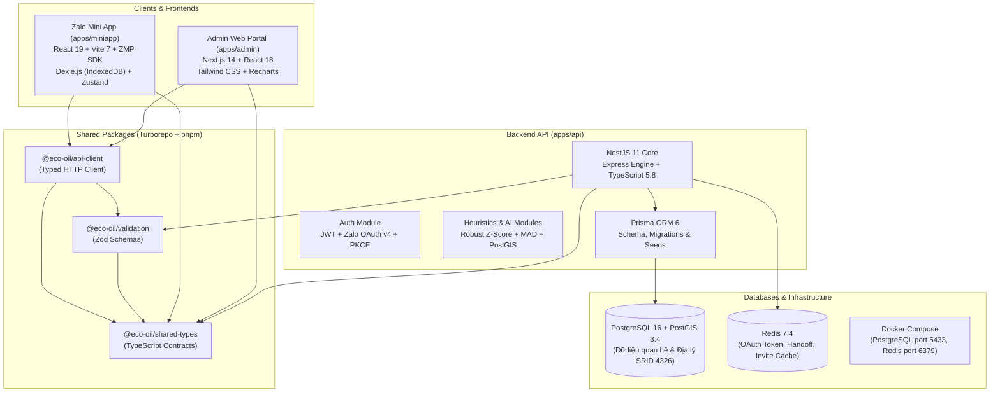

# Báo Cáo Tóm Tắt Công Nghệ Sử Dụng (Tech Stack)
## Dự án: Nền tảng Quản lý Thu gom Dầu ăn Đã qua Sử dụng (Eco-Oil UCO Platform)

---

## 1. Sơ Đồ Kiến Trúc Công Nghệ Toàn Diện

---

## 2. Danh Mục Công Nghệ Chi Tiết Theo Phân Hệ

### 2.1. Quản lý Dự án & Hạ tầng Monorepo (Repository Orchestration)
* **Turborepo 2.x:** Công cụ điều phối build pipeline thông minh của Vercel. Tự động hóa quá trình build song song (`--parallel`), quản lý dependency graph giữa các package, hỗ trợ caching các tác vụ `build`, `lint`, `typecheck`, `test`.
* **pnpm 11.x (pnpm Workspaces):** Trình quản lý gói tối ưu tốc độ và dung lượng đĩa nhờ cơ chế hard-link và content-addressable storage. Mô hình strict node_modules loại bỏ hoàn toàn hiện tượng phantom dependencies (gọi thư viện không khai báo).
* **Node.js 22+ & TypeScript 5.8+:** Môi trường thực thi JavaScript hiện đại nhất, hỗ trợ ES Modules nguyên bản và kiểm tra kiểu dữ liệu nghiêm ngặt xuyên suốt toàn bộ dự án (`strict: true`).

---

### 2.2. Backend API (`apps/api`)
Backend được xây dựng theo kiến trúc hướng module, chuẩn Clean Architecture của NestJS:
* **Core Framework:** **NestJS 11** (trên nền HTTP engine Express 5) - Cung cấp Dependency Injection mạnh mẽ, Controller, Service, Guard, Interceptor và Exception Filters toàn cục.
* **Cơ sở dữ liệu & ORM:**
  * **PostgreSQL 16:** Hệ quản trị cơ sở dữ liệu quan hệ chính, đảm bảo tính toàn vẹn dữ liệu ACID.
  * **PostGIS 3.4 Extension:** Module mở rộng tính toán không gian địa lý. Dữ liệu tọa độ quán và trạm được lưu trữ chuẩn không gian `SRID 4326 (WGS 84)`, lập chỉ mục không gian `GiST` để đo cự ly `ST_Distance` đường chim bay cực nhanh.
  * **Prisma ORM 6.x:** Quản lý cơ sở dữ liệu theo định hướng schema-first (`schema.prisma`), tự động tạo TypeScript Client với type-safety 100%, quản lý lịch sử tiến hóa bảng thông qua 26 bản migration.
* **Bộ nhớ đệm & Phiên làm việc (Caching & State):**
  * **Redis 7.4 (thư viện `ioredis`):** Lưu trữ mã xác thực một lần (One-time handoff code), mã mời kích hoạt tài khoản collector trong 60 giây, và blacklist token khi người dùng đăng xuất.
* **Bảo mật & Phân quyền (Security & RBAC):**
  * **JSON Web Token (`@nestjs/jwt`):** Cấp phát Access Token ngắn hạn và Refresh Token dạng xoay vòng (Rotation) có lưu hash mã hóa trong database.
  * **Zalo OAuth v4 + PKCE:** Xác thực người dùng thực tế với giao thức OAuth kết hợp `code_challenge` chống tấn công nghe lén mã nguồn mở.
  * **Mã hóa AES-256-GCM:** Mã hóa tham số `state` trong luồng OAuth để chống giả mạo danh tính (CSRF).
  * **Role-Based Access Control (RBAC):** `RolesGuard` kết hợp `JwtAuthGuard` kiểm soát quyền truy cập chi tiết cho 4 vai trò: `MERCHANT`, `COLLECTOR`, `STATION`, `ADMIN`.
* **Kiểm tra dữ liệu (Validation):** Tích hợp song song `class-validator`, `class-transformer` và **Zod 3** để validate mọi payload đầu vào tại tầng Pipe.

---

### 2.3. Frontend Zalo Mini App (`apps/miniapp`)
Ứng dụng di động tối ưu hóa trải nghiệm thực địa cho Chủ quán và Người thu gom:
* **Build Tool & Runtime:** **Vite 7** - Khởi động server phát triển tức thì qua ESM nguyên bản, tối ưu hóa bundle nhỏ gọn cho môi trường web di động.
* **Giao diện:** **React 19** - Ứng dụng phiên bản React mới nhất với cơ chế rendering tối ưu.
* **Tích hợp Nền tảng Zalo:** **ZMP SDK 2.53 (Zalo Mini App SDK)** - Tương tác trực tiếp với các tính năng gốc của điện thoại: lấy số điện thoại, định danh Zalo User ID, quét mã QR camera, mở bản đồ định vị.
* **Cơ chế Ngoại tuyến (Offline-First Engine):** **Dexie.js 4 (IndexedDB Wrapper)** - Đóng vai trò cơ sở dữ liệu cục bộ trên điện thoại, lưu trữ danh sách đơn hàng và các giao dịch thu gom khi mất sóng 4G/Wifi.
* **Quản lý Trạng thái (State Management):**
  * **TanStack React Query 5:** Quản lý server state, tự động cache dữ liệu, background refetch và xử lý trạng thái loading/error.
  * **Zustand 5:** Quản lý client state (phiên đăng nhập, giỏ đơn gom tạm, bộ lọc ca làm việc) cực kỳ nhẹ và không bị boilerplate như Redux.
* **Xử lý Hình ảnh:** HTML5 Canvas API - Thuật toán Heuristic phân tích độ sáng (Luminance), độ bão hòa (Hue/Saturation), độ nhám bề mặt (Texture) để phân hạng dầu và tự động nén ảnh chụp xuống kích thước tối đa 1280px trước khi tải lên server.

---

### 2.4. Frontend Quản trị Web Portal (`apps/admin`)
Bảng điều khiển tập trung cho nhà quản lý và bộ phận kế toán/đối soát:
* **Framework:** **Next.js 14 (App Router)** - Sử dụng mô hình Server Components kết hợp Client Components linh hoạt, tối ưu hiệu năng tải trang quản trị.
* **Thư viện UI & Styling:**
  * **Tailwind CSS 3 + PostCSS + Autoprefixer:** Xây dựng giao diện hiện đại, chuẩn Responsive cho cả máy tính và máy tính bảng, phong cách trực quan lấy cảm hứng từ kinh tế tuần hoàn (xanh ngọc lục bảo Emerald, xanh Slate).
* **Trực quan hóa Dữ liệu (Data Visualization):** **Recharts 2** - Biểu đồ trực quan gồm `LineChart`, `ResponsiveContainer`, `Tooltip`, `CartesianGrid` để theo dõi sản lượng thu gom theo ngày, biểu đồ backtest sai số dự báo AI, và bảng phân tích cảnh báo bất thường.
* **Công cụ Sinh mã QR:** Thư viện `qrcode` để sinh mã QR vật lý cho từng can dầu xuất xưởng từ kho.

---

### 2.5. Các Thư Viện Dùng Chung Nội Bộ (`packages/*`)
Nhờ cấu trúc Monorepo, các package nội bộ được chia sẻ trực tiếp mà không cần xuất bản lên npm công cộng:
* **`@eco-oil/shared-types`:** Định nghĩa toàn bộ kiểu dữ liệu dùng chung (DTO, Model Interfaces, Enums: `ContainerState`, `OrderStatus`, `Role`, `RiskLevel`...). Thay đổi kiểu dữ liệu ở backend sẽ báo lỗi TypeScript ngay lập tức tại frontend.
* **`@eco-oil/validation`:** Chứa toàn bộ các bộ luật kiểm tra định dạng dữ liệu (Zod Schemas) cho việc tạo đơn, gán can, tạo trạm, lọc danh sách.
* **`@eco-oil/api-client`:** Thư viện gọi API thống nhất xây dựng trên `fetch`, tích hợp sẵn cơ chế đính kèm JWT Bearer token, tự động gọi endpoint `/auth/refresh` khi token hết hạn và retry request trong suốt với người dùng.

---

### 2.6. Kiểm Thử & Đảm Bảo Chất Lượng (Testing & QA)
* **Kiểm thử Backend:**
  * **Jest 29 + ts-jest:** Chạy toàn bộ Unit Tests cho các service, thuật toán tính toán rủi ro và các module dự báo.
  * **Supertest:** Thực hiện E2E Integration Tests, giả lập các luồng gọi HTTP API thực tế từ đăng ký đến thanh toán.
* **Kiểm thử Frontend:**
  * **Vitest 3:** Framework kiểm thử siêu tốc độ đồng bộ với Vite.
  * **Testing Library React & JSDOM:** Kiểm thử hành vi giao diện người dùng (User Interactions) và tính chính xác của các component.
  * **Fake-IndexedDB:** Giả lập môi trường cơ sở dữ liệu trình duyệt IndexedDB để test tính năng Offline Outbox Sync trong môi trường dòng lệnh (Node.js).
* **Kiểm tra Định dạng & Quy chuẩn Code:**
  * **ESLint 9 (Flat Config):** Bắt buộc tuân thủ tiêu chuẩn mã nguồn nghiêm ngặt, ngăn ngừa biến không sử dụng hoặc lỗi type bất thường.
  * **Prettier 3:** Tự động định dạng code thống nhất trên toàn repository.

---

### 2.7. Ảo Hóa & Triển Khai Hạ Tầng (DevOps & Deployment)

| Thành phần | Môi trường Local Development | Môi trường Production / Cloud Demo |
|---|---|---|
| **Container Engine** | Docker Compose (PostgreSQL 16 PostGIS port 5433, Redis 7.4 port 6379) | Cloud Managed Containers |
| **Database Server** | Local Docker Container (`uco-postgres`) | **Neon PostgreSQL** / **Supabase** (PostGIS enabled) |
| **In-Memory Cache** | Local Docker Container (`uco-redis`) | **Upstash Redis** (Serverless Redis over REST/TCP) |
| **Backend API Server** | `pnpm dev` (NestJS CLI Watch mode) | **Render** Web Service (Node.js LTS Environment) |
| **Frontend Admin** | `next dev -p 3001` | **Vercel** (Next.js Edge/Node Hosting) |
| **Frontend Mini App** | `vite --host 0.0.0.0` (Port 5173) | **Vercel** (Web Demo) & **Zalo Cloud Platform** (ZMP Package) |
| **CI/CD Pipeline** | Local Git Pre-commit hooks | **GitHub Actions** (chạy toàn bộ typecheck, lint, test, build) |

---

## 3. Bảng Tổng Hợp Thông Số Kỹ Thuật

| Hạng mục | Công nghệ chính | Phiên bản | Ghi chú kiến trúc |
|---|---|---|---|
| **Monorepo Tool** | Turborepo | `2.10.x` | Điều phối build pipeline & cache |
| **Package Manager**| pnpm | `11.16.x` | Quản lý phụ thuộc cô lập & tốc độ cao |
| **Backend Runtime** | Node.js | `22.x` | LTS |
| **Language** | TypeScript | `5.8.x` | Strict typing 100% |
| **Backend Framework**| NestJS | `11.0.x` | Modular, Dependency Injection |
| **Database** | PostgreSQL | `16` | Hỗ trợ PostGIS 3.4 |
| **ORM** | Prisma ORM | `6.5.x` | Type-safe query & Migration engine |
| **Cache Store** | Redis | `7.4` | In-memory key-value store |
| **Admin Frontend** | Next.js | `14.2.x` | App Router & React 18 |
| **Mini App Frontend**| React + Vite | `React 19` / `Vite 7` | Tối ưu di động, SPA siêu nhẹ |
| **Zalo Platform SDK**| ZMP SDK | `2.53.x` | Zalo Mini App Bridge |
| **Offline Storage** | Dexie.js | `4.4.x` | Wrapper IndexedDB chống mất dữ liệu |
| **Data Fetching** | TanStack Query | `5.101.x` | Server state management & cache |
| **Client State** | Zustand | `5.0.x` | Minimalist reactive state |
| **CSS Framework** | Tailwind CSS | `3.4.x` | Utility-first styling (Admin) |
| **Charts** | Recharts | `2.15.x` | Trực quan hóa dữ liệu thống kê |
