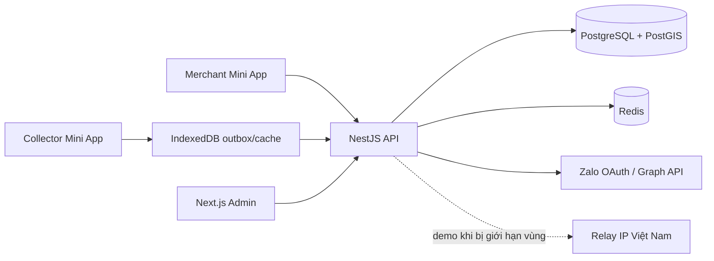

# Báo cáo tổng quan dự án Eco-Oil UCO Platform

**Ngày rà soát:** 29/08/2026  
**Phạm vi:** toàn bộ mã nguồn, cấu hình, schema/migration, tài liệu, script seed, CI và test được theo dõi trong repository. Các thư mục sinh tự động (`node_modules`, `.turbo`, `.pnpm-store`, build output), log và tệp ảnh nhị phân chỉ được kiểm kê, không được xem như mã nguồn cần phân tích.

## 1. Tóm tắt điều hành

Eco-Oil là một nền tảng thí điểm quản lý chuỗi thu gom dầu ăn đã qua sử dụng (UCO), phục vụ ba nhóm nghiệp vụ chính:

- **Quán/merchant:** đăng ký, chờ duyệt và cấp can; báo can sẵn sàng; theo dõi đơn, lịch sử thu gom và thanh toán.
- **Người thu gom/collector:** nhận tuyến theo địa bàn, quét QR can, ghi nhận khối lượng/chất lượng/ảnh/GPS trong điều kiện có thể mất mạng, đồng bộ lại và bàn giao dầu tại trạm.
- **Quản trị/admin:** duyệt quán, cấp và luân chuyển can, quản lý địa bàn/người thu gom/trạm, đối soát, cảnh báo, đơn giá và thanh toán, theo dõi hiệu quả các thuật toán hỗ trợ quyết định.

Dự án đã vượt xa một backend MVP đơn giản. Mã hiện tại bao phủ gần trọn chu trình vận hành từ onboarding đến thanh toán, có xử lý offline, idempotency, PostGIS, RBAC, audit log, OAuth Zalo, dự báo/tối ưu tuyến và phát hiện bất thường. Tuy vậy, mức sẵn sàng production vẫn bị giới hạn bởi ba nhóm vấn đề: CI backend đang đỏ một unit test, test tích hợp chưa được xác minh trong môi trường rà soát, và tài liệu vận hành/Zalo đã lệch đáng kể so với mã nguồn hiện tại.

## 2. Quy mô repository

| Khu vực | Số tệp mã | Số dòng gần đúng | Vai trò |
|---|---:|---:|---|
| `apps/api/src` | 93 | 11.118 | NestJS API và thuật toán nghiệp vụ |
| `apps/api/test` | 16 | 2.262 | E2E/setup backend |
| `apps/miniapp/src` | 35 | 5.209 | React/Vite Zalo Mini App và offline outbox |
| `apps/miniapp/test` | 15 | 1.915 | Unit/behavior test Mini App |
| `apps/admin/src` | 35 | 1.825 | Next.js Admin Dashboard |
| `packages` | 6 | 3.302 | Types, validation và HTTP client dùng chung |
| `prisma/migrations` | 26 | 679 | Lịch sử tiến hóa cơ sở dữ liệu |

Toàn repository có **281 tệp được Git theo dõi**, **18 model Prisma**, **21 enum**, **26 migration** và **86 route handler HTTP**. Trong đó 85 route nằm dưới `/api/v1`; route còn lại phục vụ tệp xác thực domain Zalo ở root.

## 3. Kiến trúc tổng thể

Repository dùng **pnpm workspace + Turborepo**, chia thành:

- `apps/api`: NestJS 11, Prisma 6, PostgreSQL 16/PostGIS, Redis, JWT, Jest/Supertest.
- `apps/miniapp`: React 19, Vite 7, TanStack Query, Zustand, Dexie/IndexedDB, ZMP SDK.
- `apps/admin`: Next.js 14, React 18, TanStack Query, Recharts, Tailwind CSS.
- `packages/shared-types`: contract TypeScript dùng chung.
- `packages/validation`: schema Zod cho request/query.
- `packages/api-client`: HTTP client dùng chung, tự refresh token và retry một lần.
- `prisma`: schema, migration và seed dữ liệu local.

## 4. Luồng nghiệp vụ chính

### 4.1 Onboarding và xác thực

Hệ thống hỗ trợ hai chế độ Zalo:

- `mock` chỉ được phép ở development/test, dùng tài khoản seed.
- `real` dùng Zalo OAuth v4, PKCE và state được mã hóa AES-256-GCM. Backend đổi authorization code, lấy profile, tạo/cập nhật user và phát hành JWT nội bộ.

Access token ngắn hạn đi cùng refresh token có rotation; refresh token chỉ lưu hash trong database. Logout có thể thu hồi một refresh token hoặc toàn bộ token của user. Guard toàn cục xác minh JWT, đối chiếu role hiện tại trong database và áp dụng RBAC theo controller.

OAuth web không đưa access/refresh token lên URL. Backend tạo one-time handoff code, lưu hash trong Redis 60 giây, frontend đổi code lấy phiên đăng nhập rồi xóa code khỏi URL. Collector mới được admin tạo ở trạng thái `PENDING_LINK`, nhận lời mời một lần qua Redis và liên kết với Zalo user sau khi kiểm tra xung đột role.

### 4.2 Merchant

Merchant có thể:

1. Đăng ký hồ sơ theo phường và GPS.
2. Chờ admin duyệt; admin có thể bổ sung tọa độ và cấp một can có QR.
3. Báo `READY` khi can đang ở quán; hệ thống chặn đơn trùng trên cùng can và giới hạn số lít theo dung tích.
4. Hủy đơn khi đơn còn `READY`.
5. Xem dashboard, đơn, lịch sử thu gom và thanh toán tuần.

Khi khu vực chưa có collector, đơn vẫn được tạo nhưng sinh cảnh báo `NO_COLLECTOR_IN_WARD`.

### 4.3 Lập tuyến và ca thu gom

Collector chỉ nhận đơn trong các phường được phân công. API tạo route preview theo các bước:

1. Lấy đơn `READY` và khoảng cách PostGIS từ vị trí hiện tại/tâm phường.
2. Chấm điểm ưu tiên theo mức đầy, thời gian từ lần thu gần nhất và khoảng cách.
3. Dự báo thể tích thu dựa trên lịch sử merchant.
4. Chọn các điểm không vượt dung tích phương tiện.
5. Tối ưu thứ tự điểm và đánh giá rủi ro vượt tải.

Khi bắt đầu ca, API claim các order trong transaction, tạo `CollectionRoute` cùng snapshot merchant/AI và đảm bảo mỗi collector chỉ có một route active. Ca chỉ được kết thúc khi không còn stop `PENDING`; chỉ được hủy khi chưa thu điểm nào.

### 4.4 Ghi nhận thu gom và offline-first

Tại mỗi điểm, collector quét QR hoặc nhập mã can, ghi lít hoặc kg, chọn hạng dầu A/B/C, đánh dấu nghi pha lẫn, chụp ảnh và lấy GPS. Ảnh được nén tối đa khoảng 1280 px, JPEG 0,7 trước khi lưu/gửi.

Mini App lưu giao dịch vào Dexie/IndexedDB trước, phân vùng theo user, giữ nguyên payload và `client_uuid`, rồi đồng bộ:

- theo batch tối đa 100 giao dịch;
- khi online trở lại, khi app visible và mỗi 30 giây;
- single-flight để tránh hai worker gửi trùng;
- retry có backoff, phục hồi record bị kẹt ở `syncing`;
- giữ outbox khi logout để không mất dữ liệu hiện trường.

Backend dùng `INSERT ... ON CONFLICT (client_uuid) DO NOTHING` trong transaction. Retry đúng UUID trả bản ghi cũ và không chạy lại side effect. Thu gom thành công chuyển order sang `COLLECTED`, can sang `IN_TRANSIT`, cập nhật route stop và thống kê merchant.

### 4.5 Giao trạm

Collector chọn trạm được đề xuất theo khoảng cách và sức chứa, chọn các transaction đã sync, nhập số đo thực tế và bằng chứng. API khóa hàng trạm và transaction bằng `FOR UPDATE`, sau đó:

- xác minh ownership và trạng thái sync;
- tính chênh lệch lít/kg;
- chặn vượt dung tích trạm;
- liên kết transaction vào phiếu giao;
- chuyển can sang `AT_STATION`;
- cộng tồn trạm;
- sinh cảnh báo nếu chênh lệch vượt ngưỡng.

Phiếu giao cũng idempotent theo `client_uuid`. Biên nhận và draft bàn giao được giữ local theo collector để sống qua reload/kill app.

### 4.6 Thanh toán và đối soát

Admin cấu hình đơn giá hiệu lực theo thời gian, theo lít hoặc kg. Khi chốt kỳ ISO week, chỉ transaction `PASS` được tạo payment. Mỗi payment giữ snapshot đơn giá, đơn vị, số lượng và thành tiền; unique `transaction_id` giúp chạy lại kỳ mà không nhân đôi. Admin có thể đánh dấu đã thanh toán; merchant xem được các khoản của mình.

Đối soát so sánh collection với station delivery, hiển thị giao dịch chưa nộp trạm, sai lệch và cho xuất CSV. Các thao tác quản trị quan trọng ghi `AuditLog`.

## 5. Dữ liệu và trạng thái miền

Các thực thể trung tâm gồm `User`, `Ward`, `Merchant`, `Collector`, `CollectorWard`, `Station`, `Container`, `CollectionOrder`, `CollectionRoute`, `CollectionRouteStop`, `CollectionTransaction`, `StationDelivery`, `OilPrice`, `Payment`, `Alert`, `AnomalyFeedback`, `AuditLog` và `RefreshToken`.

Các vòng đời quan trọng:

- Can: `AT_MERCHANT → IN_TRANSIT → AT_STATION → AT_MERCHANT`.
- Order: `READY → ASSIGNED → COLLECTED`, hoặc `READY → CANCELLED`.
- Route: `ACTIVE → COMPLETED/CANCELLED`.
- Merchant approval: `PENDING → APPROVED/REJECTED`.
- Payment: `PENDING → PAID/CANCELLED`.

PostGIS lưu vị trí merchant, station và điểm thu ở SRID 4326; GiST index hỗ trợ đo khoảng cách. Schema còn trường polygon ranh giới phường, nhưng UI hiện ghi rõ bản đồ/range polygon chưa được triển khai.

## 6. Các chức năng “AI” và phân tích

Tên giao diện dùng “AI”, nhưng mã hiện tại chủ yếu là các thuật toán quyết định **deterministic, có giải thích**, không có dịch vụ model hoặc pipeline training trong repository:

- Dự báo thể tích thu của merchant từ lịch sử và độ tin cậy.
- Backtest dự báo và dashboard đo sai số.
- Chấm điểm ưu tiên pickup.
- Tối ưu thứ tự tuyến và ước tính quãng đường tiết kiệm.
- Đánh giá nguy cơ vượt dung tích xe.
- Dự báo ngày trạm đầy và sinh cảnh báo.
- Phát hiện bất thường bằng median/MAD, robust z-score, mật độ kg/lít, thời điểm và tần suất.
- Phân hạng dầu từ ảnh bằng heuristic chạy trên thiết bị dựa trên luminance, màu, texture và blur.

Điểm tốt là kết quả đều có reason code, confidence/evidence và admin có thể phản hồi `CONFIRMED_ANOMALY`, `FALSE_POSITIVE` hoặc `UNSURE`. Điểm cần truyền thông đúng là module ảnh tự ghi rõ “experimental”; không nên quảng bá như mô hình AI đã được huấn luyện hoặc có độ chính xác được kiểm chứng.

## 7. Admin Dashboard

Admin hiện có 11 khu vực điều hướng:

- Tổng quan KPI và biểu đồ lít thu gom.
- Thanh toán và đơn giá.
- Đối soát và xuất CSV.
- Hiệu quả dự báo, phân hạng ảnh và phát hiện bất thường.
- Cảnh báo nghiệp vụ và feedback bất thường.
- Trạm và dự báo đầy trạm.
- Phường/địa bàn.
- Quán và hiệu suất quán.
- Kho can, QR, gán/thu hồi/hủy vận chuyển/trả can.
- Duyệt quán và cấp can.
- Collector, địa bàn, dung tích xe, lời mời liên kết và hiệu suất.

TanStack Query quản lý cache/mutation; trang cảnh báo có optimistic update khi resolve. Admin login dùng password chỉ tồn tại ở backend; Zalo ID và phone public chỉ là định danh, không phải secret.

## 8. Hạ tầng và triển khai

Môi trường local dùng Docker Compose với PostGIS 16 trên cổng 5433 và Redis 7.4 trên 6379. CI GitHub Actions dựng cả hai service, generate Prisma, migrate, seed rồi chạy `typecheck → lint → test → build`.

Tài liệu mô tả demo cloud trên Neon, Upstash, Render và hai project Vercel. Vì Prisma schema nằm ở root, Render phải generate với đường dẫn schema riêng và build filter có dấu `...` để kéo package phụ thuộc.

Migration production hiện vẫn là bước thủ công trước khi push do Neon pooled connection không lấy được advisory lock của Prisma. Đây là điểm vận hành nhạy cảm: deploy code trước migration có thể làm API 500. Hướng dài hạn đã được ghi trong tài liệu là thêm direct connection hoặc one-off migration job.

Redis là optional đối với health/API cơ bản, nhưng là dependency bắt buộc trên thực tế cho OAuth handoff và collector invite. Khi không cấu hình Redis, health trả `redis: disabled` và vẫn `status: ok`; vì vậy monitoring cần phân biệt “API sống” với “đăng nhập/lời mời hoạt động”.

## 9. Trạng thái kiểm tra tại thời điểm rà soát

| Kiểm tra | Kết quả |
|---|---|
| Git working tree | Sạch trước khi tạo báo cáo |
| TypeScript toàn workspace | **Đạt** — 9/9 Turbo tasks |
| ESLint toàn workspace | **Đạt** — 6/6 packages |
| Mini App unit/behavior test | **Đạt** — 104/104 |
| Admin test | **Đạt** — 41/41 |
| Backend unit test trong `src` | **Chưa đạt** — 182/183, 20/21 suite |
| Backend E2E | **Chưa chạy trong lần rà soát** — Docker không khả dụng trong PATH |
| Build production | Chưa chạy riêng; typecheck đã đạt |

Unit test backend lỗi tại `collector-invites.spec.ts`: case “merchant đã có profile” mong `ConflictException` nhưng nhận `TypeError`. Nguyên nhân trực tiếp nằm ở test double `restoreOneTime: jest.fn()` trả `undefined`, trong khi production `RedisService.restoreOneTime()` luôn trả `Promise<void>` và code gọi `.catch(...)`. Đây có vẻ là **fixture test chưa mô phỏng đúng async contract**, không phải bằng chứng luồng production ném TypeError; tuy nhiên nó vẫn làm CI đỏ và cần sửa.

## 10. Điểm mạnh

- Domain model đầy đủ và có lịch sử migration rõ ràng.
- Offline-first được xử lý thực chất, không chỉ cache giao diện.
- Idempotency được đặt ở database và bao trùm side effect.
- Dùng transaction và row lock đúng tại các đoạn cập nhật tồn/trạng thái cạnh tranh.
- RBAC, refresh rotation, hash token, one-time code và audit log tạo nền bảo mật tốt.
- Validation Zod và shared types giảm lệch contract giữa ba ứng dụng.
- Thuật toán hỗ trợ quyết định có giải thích, confidence và feedback loop.
- UI merchant/collector/admin đã bao phủ hầu hết luồng vận hành thực tế.
- Bộ test frontend khá sâu vào các tình huống mất mạng, reload, retry, quyền Zalo và idempotency.

## 11. Rủi ro và khoảng trống ưu tiên

### Ưu tiên cao

1. **CI backend đang đỏ:** sửa mock async trong test lời mời collector và chạy lại toàn suite.
2. **Chưa có bằng chứng E2E hiện tại:** cần chạy PostgreSQL/PostGIS + Redis, migrate/seed và toàn bộ `pnpm test`, đặc biệt full-flow sạch.
3. **Migration production thủ công:** dễ xảy ra code mới chạy trên schema cũ; cần direct URL hoặc migration job có kiểm soát.
4. **Zalo production chưa có bằng chứng acceptance:** code đã có app config, OAuth, location/QR/camera/native storage và `build:zmp`, nhưng checklist thiết bị Android/iOS, quyền và trạng thái duyệt vẫn chưa được đánh dấu hoàn tất.

### Ưu tiên trung bình

5. **Tài liệu lệch mã:** README ghi 41 endpoint trong khi hiện có 86 route handler; roadmap Zalo ngày 19/08 vẫn nói nhiều phần “chưa làm” dù code hiện tại đã triển khai.
6. **Seed admin không thống nhất:** `prisma/seed.ts` dùng phone `0990000001`, còn `seed:demo`, `apps/admin/.env.example` và `DEPLOY.md` dùng `0900000000`. Người mới có thể đăng nhập thất bại tùy lệnh seed.
7. **Hard-code phường trong luồng sửa merchant:** `MerchantApprovalView` dùng UUID phường cố định khi cập nhật profile bị từ chối, dù giao diện đã tải danh sách phường. Điều này có thể ghi sai địa bàn ngoài dữ liệu demo.
8. **Health không phản ánh dependency theo tính năng:** Redis disabled vẫn xanh dù OAuth real và collector invite không dùng được.
9. **Tệp quá lớn:** `AdminService` khoảng 1.700 dòng và `CollectorFlow.tsx` khoảng 1.550 dòng; khó review, test cô lập và thay đổi an toàn.
10. **Package dùng chung chưa có test riêng:** `api-client`, `shared-types`, `validation` chỉ in “No ... tests”; hiện được bảo vệ gián tiếp qua app test.

### Ưu tiên thấp/dài hạn

11. Hoàn thiện polygon ranh giới phường và bản đồ nếu đây là yêu cầu sản phẩm thật.
12. Hiệu chỉnh các heuristic bằng dữ liệu gắn nhãn thực, đặc biệt phân hạng ảnh và ngưỡng bất thường.
13. Bổ sung observability cho outbox backlog, OAuth handoff, relay, migration version và alert rate.
14. Tách ảnh base64/data URL sang object storage nếu lưu lượng/độ phân giải tăng; hiện body limit mặc định là 10 MB.

## 12. Đề xuất lộ trình gần

### Trong 1–2 ngày

- Sửa test double `restoreOneTime` thành mock async và chạy lại toàn bộ unit test.
- Đồng bộ số điện thoại admin giữa hai seed và tài liệu.
- Thay UUID phường hard-code bằng `wardId` người dùng chọn.
- Cập nhật README về số route và trạng thái Zalo hiện tại.

### Trong 1 sprint

- Chạy E2E trên database sạch trong local/CI và lưu báo cáo kết quả.
- Tự động hóa migration production qua direct connection/one-off job.
- Thêm health/readiness chi tiết theo capability: DB, Redis, OAuth handoff, invite.
- Tách `CollectorFlow` theo màn hình/hook và `AdminService` theo bounded context.
- Thêm contract test trực tiếp cho `api-client` và validation schema quan trọng.

### Trước production hoặc gửi duyệt Zalo

- Test Android/iOS thật: login, permission deny/grant, cold start, kill/reopen, offline sync, QR, camera/album, native storage.
- Xác nhận CORS origin Zalo, API domain, privacy policy, nội dung xin quyền và rollback version.
- Chạy full CI gồm build; kiểm tra secret scan và kích thước bundle.
- Tạo dashboard/alert cho migration mismatch, Redis disabled, sync failure và station capacity.

## 13. Kết luận

Eco-Oil hiện là một **vertical slice vận hành UCO khá hoàn chỉnh**, có chiều sâu kỹ thuật tốt ở dữ liệu không gian, offline sync, idempotency, đối soát và quản trị. Kiến trúc monorepo và contract dùng chung phù hợp với quy mô hiện tại. Trạng thái hợp lý nhất để mô tả là **demo/pilot giàu tính năng, gần production về mặt luồng nghiệp vụ nhưng chưa production-ready về xác minh vận hành**.

Nếu xử lý test backend đang đỏ, đồng bộ tài liệu/seed, chạy lại E2E sạch và hoàn thành acceptance trên thiết bị Zalo thật, dự án sẽ có một nền tảng đáng tin cậy để bước từ pilot sang triển khai có kiểm soát.
