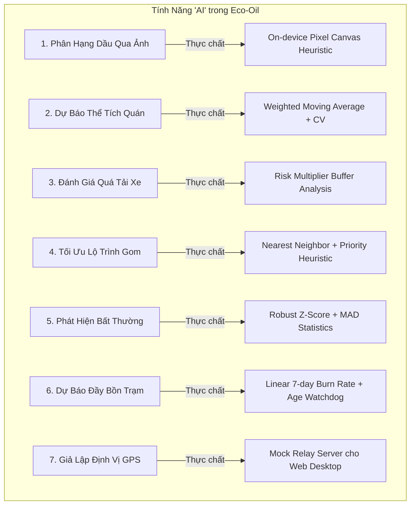

# Báo Cáo Tính Năng & Phân Tích Các Module AI Mock / Heuristic
## Dự án: Nền tảng Quản lý Thu gom Dầu ăn Đã qua Sử dụng (Eco-Oil UCO Platform)

---

## 1. Giới thiệu tổng quan về Nền tảng Eco-Oil
**Eco-Oil (UCO Platform)** là giải pháp công nghệ toàn diện nhằm số hóa và tối ưu hóa chuỗi cung ứng thu gom **Dầu ăn đã qua sử dụng (Used Cooking Oil - UCO)**. Nền tảng giải quyết bài toán chống thất thoát, ngăn chặn dầu thải quay lại chuỗi tiêu thụ thực phẩm của người, đảm bảo dầu được chuyển đến các nhà máy sản xuất nhiên liệu sinh học (Biodiesel/SAF) theo các tiêu chuẩn chứng chỉ bền vững (ISCC).

Hệ thống phân quyền (RBAC) 4 vai trò chính:
1. **Merchant (Chủ quán ăn / Nhà hàng):** Điểm phát sinh dầu ăn thải.
2. **Collector (Tài xế / Người thu gom):** Lực lượng cơ động đến từng quán thu gom, kiểm định và vận chuyển.
3. **Station (Trạm tiếp nhận / Kho trung chuyển):** Điểm tập kết dầu, cân đối soát và bàn giao số lượng lớn.
4. **Admin (Quản trị viên & Kế toán vận hành):** Quản lý hồ sơ, cấp phát can, điều phối địa bàn, đối soát, định giá và thanh toán.

---

## 2. Danh mục Tính năng Chính & Cách thức Hoạt động

### 2.1. Phân hệ Quán ăn (Merchant - Zalo Mini App)
* **Đăng ký hồ sơ điểm thu gom:**
  * Quán đăng ký trực tiếp qua Zalo Mini App: khai báo tên quán, địa chỉ, số điện thoại, phường/xã và tọa độ GPS thực tế.
  * Hồ sơ chuyển sang trạng thái chờ duyệt (`PENDING`), bảo đảm tính xác thực trước khi thu gom.
* **Quản lý can dầu gắn định danh QR:**
  * Mỗi quán sau khi duyệt được gán can dầu tiêu chuẩn (dung tích 20L, 25L, 30L...) có dán mã QR vật lý chống làm giả.
  * Theo dõi vòng đời can: Can ở quán (`AT_MERCHANT`), Can đang vận chuyển (`IN_TRANSIT`), Can đã nộp trạm (`AT_STATION`).
* **Báo can dầu sẵn sàng thu gom (`READY`):**
  * Khi dầu đầy can, quán thao tác báo đơn gom ngay trên giao diện: nhập lượng dầu ước tính (lít).
  * **Quy tắc chặn lỗi nghiệp vụ:** Hệ thống chặn không cho tạo đơn trùng trên can đang có đơn chưa hoàn thành; không cho phép khai báo vượt dung tích vật lý của can; cho phép quán hủy đơn khi tài xế chưa nhận tuyến.
* **Theo dõi lịch sử & Tài chính tuần:**
  * Xem nhật ký các lần collector đến lấy dầu (thời gian, số lít/kg thực tế, hình ảnh, người gom).
  * Theo dõi phiếu thanh toán định kỳ hàng tuần theo đơn giá đã công bố.

---

### 2.2. Phân hệ Người thu gom (Collector - Mini App Hiện Trường)
* **Lập tuyến thông minh & Bắt đầu ca (Route Planning):**
  * Tự động quét và gom tất cả đơn `READY` thuộc các phường mà collector được phân công phụ trách.
  * Thuật toán sắp xếp thứ tự điểm dừng (stops) tối ưu quãng đường và cảnh báo dung tích thùng xe trước khi bắt đầu ca.
  * Khóa đơn hàng trong transaction khi bắt đầu ca để tránh xung đột giữa nhiều collector.
* **Thu gom tại quán (Offline-Safe Pickup Flow):**
  * **Quét mã QR can:** Xác thực can dầu thuộc đúng quán và khớp với đơn hàng.
  * **Ghi nhận thông số đo lường:** Nhập khối lượng thực tế bằng cân điện tử (kg) hoặc thể tích (lít), tự động tính chuyển đổi qua tỷ trọng chuẩn ($0.91 \text{ kg/lít}$).
  * **Đánh giá chất lượng:** Chọn phân hạng dầu (A, B, C); gắn cờ cảnh báo nếu nghi ngờ lẫn nước, tạp chất, khét cháy hoặc lẫn mỡ động vật.
  * **Bằng chứng ảnh & GPS:** Chụp ảnh can/dầu thực tế (tự động nén ảnh tối đa 1280px để tiết kiệm băng thông 4G) và ghi lại tọa độ GPS tại thời điểm lấy hàng.
* **Cơ chế Ngoại tuyến (Offline-First Outbox Sync):**
  * Cho phép hoạt động bình thường ngay cả khi quán nằm trong hẻm sâu, tầng hầm mất sóng di động.
  * Toàn bộ dữ liệu thu gom được mã hóa và ghi vào IndexedDB (thư viện Dexie) trên điện thoại.
  * Tự động đồng bộ ngầm từng mẻ (batch) lên server khi có mạng internet trở lại, đảm bảo tính bất biến (idempotent) qua mã định danh `client_uuid`.
* **Bàn giao dầu tại trạm (Station Delivery):**
  * Gợi ý trạm trung chuyển gần nhất còn dung tích tiếp nhận.
  * Collector chọn các giao dịch đã thu gom trong ca, nộp can dầu đầy và nhận lại can rỗng sạch để tiếp tục ca sau.

---

### 2.3. Phân hệ Trạm tiếp nhận (Station)
* **Tiếp nhận & Cân tổng bàn giao:**
  * Trạm trưởng quét mã giao nhận hoặc chọn collector bàn giao.
  * Cân tổng khối lượng thực nhận tại bồn/cân sàn trạm, kiểm tra độ hao hụt (sai lệch giữa lượng thu gom lẻ và lượng thực nhập trạm).
* **Quản lý sức chứa & Lưu trữ:**
  * Theo dõi dung tích bồn chứa thực tế, thể tích dầu đã nộp và thể tích còn trống.
  * Giám sát thời gian lưu trữ dầu (Storage Age Watchdog): Cảnh báo nếu dầu lưu tại trạm vượt quá 14 ngày cần chuyển tiếp về nhà máy tái chế để tránh suy giảm chỉ số axit (FFA).

---

### 2.4. Phân hệ Quản trị viên (Admin Portal - Next.js)
* **Duyệt quán & Cấp phát can:**
  * Kiểm tra tọa độ quán trên bản đồ, phê duyệt/từ chối quán mới.
  * Cấp phát can dầu mới từ kho can chưa gán (`UNASSIGNED`) về quán.
* **Quản lý Địa bàn & Điều phối Collector:**
  * Khai báo danh mục Phường/Xã/Quận, gán địa bàn hoạt động cho từng collector.
  * Cấu hình dung tích phương tiện (xe máy thùng 100L - 150L, xe ba gác, bán tải...).
  * Phát hành mã mời liên kết tài khoản Zalo một lần (One-Time Invite Link) cho collector mới.
* **Kho can & Truy xuất nguồn gốc QR:**
  * Quản lý trạng thái từng can trong hệ thống, xuất mã QR in ấn, thu hồi can hỏng hoặc hủy can mất mát.
* **Đối soát thu gom vs Nhập trạm (Reconciliation Engine):**
  * Tự động so khớp tổng số lít/kg collector lấy tại quán và số lít/kg trạm thực nhận.
  * Cảnh báo chênh lệch vượt ngưỡng (ngưỡng mặc định 2%), lọc các giao dịch chưa nộp trạm, xuất báo cáo đối soát ra file Excel/CSV.
* **Cấu hình Đơn giá & Thanh toán tự động (Payments Engine):**
  * Thiết lập đơn giá mua dầu theo thời gian hiệu lực (áp dụng theo lít hoặc kg).
  * Định kỳ chốt tuần (ISO Week): Tự động gom các giao dịch đạt chuẩn (`PASS`), tính toán số tiền chi trả cho từng quán, đánh dấu trạng thái giải ngân (`PAID`).
* **Hệ thống Cảnh báo & Audit Log:**
  * Ghi lại nhật ký kiểm toán (Audit Log) cho mọi thao tác can thiệp dữ liệu nhạy cảm.
  * Bảng cảnh báo rủi ro vận hành tập trung: Lệch tọa độ GPS quá 500m, đơn không có người gom, can bị hủy hành trình, trạm đầy bồn.

---

## 3. Phân tích Các Tính năng Được "Mock Data" / Sử Dụng Thuật toán Heuristic Thay Thế Cho AI

Trong phiên bản hiện tại, dự án **chưa tích hợp API AI đám mây bên thứ ba (như OpenAI, Claude, Google Vision) hay triển khai server model PyTorch/TensorFlow nặng**. Thay vào đó, toàn bộ các tính năng mang nhãn "AI" trên giao diện được xây dựng bằng **Deterministic Heuristics (Thuật toán định lượng theo luật), Phân tích Thống kê mẫu (Statistical Inference)** và **Mock Engine có thể giải trình (Explainable AI Engine)**. 

Kiến trúc này được thiết kế sẵn cấu trúc dữ liệu (`reason_codes`, `confidence`, `features`, `verdict`) để sẵn sàng thay thế bằng mô hình Machine Learning / Deep Learning thực tế trong tương lai.

Dưới đây là chi tiết các tính năng này:

---

### 3.1. Phân hạng dầu tự động từ ảnh chụp (Oil Image Quality Analyzer)
* **Giao diện hiển thị:** Collector chụp ảnh can dầu; hệ thống hiển thị: *"AI gợi ý: Hạng A - Độ tin cậy: Cao (Lý do: Màu sáng, độ trong cao)"*.
* **Bản chất kỹ thuật (Mock/Heuristic):**
  * Tệp mã nguồn: `apps/miniapp/src/lib/oil-image-analyzer.ts`.
  * Không dùng mạng nơ-ron tích chập (CNN). Thuật toán đọc mảng pixel trực tiếp trên trình duyệt qua HTML5 Canvas `getImageData` và tính toán:
    * **Độ sáng trung bình (Mean Luminance):** Lọc ảnh quá tối ($<0.24$) hoặc cháy sáng ($>0.97$).
    * **Tỷ lệ màu vàng/nâu (Hue & Saturation):** Kiểm tra góc Hue từ $18^\circ$ đến $68^\circ$.
    * **Độ nhám và cặn lắng (Texture / Sediment Score):** Tính độ sai biệt pixel liền kề để phát hiện cặn dầu.
    * **Độ mờ (Blur Score):** Cảnh báo nếu ảnh out nét.
  * **Cơ chế phân hạng:**
    * Nếu độ sáng thấp hoặc cặn nhiều $\rightarrow$ Gợi ý Hạng C.
    * Nếu màu vàng sáng trong, ít cặn $\rightarrow$ Gợi ý Hạng A.
    * Còn lại $\rightarrow$ Gợi ý Hạng B.
  * **Cờ giải trình:** Trả về `provider: 'on-device-heuristic'`, `model_version: 'oil-image-heuristic-v1'`. Cho phép người thu gom xem gợi ý nhưng **bắt buộc người thu gom phải là người xác nhận cuối cùng**.

---

### 3.2. Dự báo thể tích dầu gom của Quán (Merchant Pickup Volume Forecast)
* **Giao diện hiển thị:** *"AI Dự báo quán có khoảng 18.5 lít dầu (Độ tin cậy: Trung bình)"*.
* **Bản chất kỹ thuật (Heuristic/Statistical Mock):**
  * Tệp mã nguồn: `apps/api/src/modules/orders/merchant-pickup-volume-forecast.ts`.
  * Không dùng mô hình chuỗi thời gian học sâu (như LSTM, Prophet).
  * Thuật toán lấy tối đa 5 lần thu gom gần nhất, tính **Trung bình gia số có trọng số** (`HISTORY_WEIGHTS = [5, 4, 3, 2, 1]`).
  * Tính hệ số biến thiên (Coefficient of Variation - $CV = \sigma / \mu$):
    * Nếu $CV \le 0.25$ và đủ 5 mẫu $\rightarrow$ Đánh dấu độ tin cậy `HIGH`.
    * Nếu lịch sử quá ít $\rightarrow$ Hòa trộn giữa lượng quán tự báo và lịch sử (`DECLARED_ESTIMATE_BLEND`).
  * **Mô-đun Backtest (`merchant-pickup-volume-backtester.ts`):** Admin có màn hình xem lại sai số dự báo trong quá khứ thông qua các chỉ số thống kê toán học: MAE (Sai số tuyệt đối trung bình), WAPE (Sai số phần trăm theo trọng số), Bias (Độ lệch dương/âm).

---

### 3.3. Đánh giá rủi ro vượt tải trọng xe (Collector Route Capacity Risk)
* **Giao diện hiển thị:** Khi collector chuẩn bị bắt đầu ca, hệ thống hiển thị: *"Cảnh báo rủi ro quá tải: Nguy cơ đầy thùng xe 108% (Mức rủi ro: Cao)"*.
* **Bản chất kỹ thuật:**
  * Tệp mã nguồn: `apps/api/src/modules/orders/collector-route-capacity-risk.ts`.
  * Dựa trên sản lượng dự báo của các điểm dừng trên tuyến, áp dụng **Hệ số đệm rủi ro (Risk Multiplier)**:
    * Dự báo tin cậy cao $\rightarrow$ Nhân hệ số $1.05$.
    * Dự báo tin cậy trung bình $\rightarrow$ Nhân $1.10$.
    * Dự báo tin cậy thấp $\rightarrow$ Nhân $1.20$.
    * Chưa có dữ liệu $\rightarrow$ Nhân $1.25$.
  * Nếu tổng thể tích điều chỉnh vượt dung tích xe $\rightarrow$ Trả về trạng thái `OVER_CAPACITY` và mã lý do `PREDICTED_OVER_CAPACITY`.

---

### 3.4. Tối ưu hóa thứ tự lộ trình thu gom (Route Order Optimization)
* **Giao diện hiển thị:** Đề xuất tuyến đường tối ưu 1 $\rightarrow$ 2 $\rightarrow$ 3 $\rightarrow$ Trạm nộp dầu, ước tính tiết kiệm quãng đường di chuyển.
* **Bản chất kỹ thuật:**
  * Tệp mã nguồn: `apps/api/src/modules/orders/orders.service.ts`.
  * Không sử dụng dịch vụ định tuyến phức tạp (như OR-Tools VRP hay Google Distance Matrix API có tính giao thông thực tế).
  * Sử dụng giải thuật **Nearest Neighbor (Điểm gần nhất kế tiếp)** kết hợp **Hàm chấm điểm ưu tiên (Priority Score)**:
    $$\text{Score} = w_1 \cdot \text{Mức đầy can} + w_2 \cdot \text{Số ngày chờ} - w_3 \cdot \text{Khoảng cách PostGIS (đường chim bay)}$$
  * Điểm nào có số điểm cao nhất và gần nhất sẽ được xếp lên đầu danh sách dừng.

---

### 3.5. Phát hiện gian lận & Bất thường giao dịch (Transaction Anomaly Scorer)
* **Giao diện hiển thị:** Tại trang Admin xuất hiện cảnh báo: *"Giao dịch nghi vấn gian lận (Điểm rủi ro: 82/100 - Bất thường tỷ trọng kg/lít và thời gian gom)"*.
* **Bản chất kỹ thuật:**
  * Tệp mã nguồn: `apps/api/src/modules/collections/transaction-anomaly-scorer.ts`.
  * Sử dụng thuật toán thống kê ngoại lai bền vững **Robust Z-Score kết hợp Median và MAD (Median Absolute Deviation)**:
    $$\text{Robust Z-Score} = \frac{0.6745 \times |x - \text{Median}|}{\text{MAD}}$$
  * Kiểm tra 4 tín hiệu độc lập:
    1. **Tỷ trọng bất thường (`DENSITY_OUTLIER`):** Dầu ăn nguyên chất có tỷ trọng $0.90 - 0.93 \text{ kg/lít}$. Nếu tỷ trọng tụt xuống $<0.85$ (pha cồn/dung môi) hoặc vọt lên $>0.98$ (pha nước, lẫn bùn/cặn nặng), hệ thống trừ điểm rủi ro tối đa 35 điểm.
    2. **Đột biến khối lượng (`MASS_OR_VOLUME_OUTLIER`):** Số lượng thu gom vượt quá 3.5 lần Robust Z-Score so với lịch sử quán đó.
    3. **Thời gian bất thường (`COLLECTION_TIME_OUTLIER`):** Gom hàng vào ban đêm/rạng sáng (2h - 4h sáng).
    4. **Tần suất bất thường (`FREQUENCY_SPIKE`):** Quán gom nhiều lần liên tiếp bất thường trong 24 giờ.
  * **Vòng lặp phản hồi Admin (Feedback Loop):** Admin có thể chấm điểm: `CONFIRMED_ANOMALY` (Đúng gian lận), `FALSE_POSITIVE` (Báo nhầm) hoặc `UNSURE`. Dữ liệu phản hồi này được lưu trữ để sau này làm tập dữ liệu huấn luyện (Ground Truth) cho mô hình Supervised Learning.

---

### 3.6. Dự báo đầy trạm tiếp nhận & Cảnh báo tồn trữ (Station Fill Forecast)
* **Giao diện hiển thị:** *"Trạm Hà Nội 01 dự kiến sẽ đầy sau 4.2 ngày nữa. Trạng thái: CRITICAL"*.
* **Bản chất kỹ thuật:**
  * Tệp mã nguồn: `apps/api/src/modules/stations/station-fill-forecast.ts`.
  * Tính tốc độ nhập dầu trung bình mỗi ngày trong vòng 7 ngày qua:
    $$\text{Days Until Full} = \frac{\text{Dung tích bể} - \text{Lượng dầu hiện có}}{\text{Tốc độ nhập TB (lít/ngày)}}$$
  * Giám sát thêm biến `oldestStoredAt`: Nếu mẻ dầu cũ nhất nằm tại trạm quá 10 ngày $\rightarrow$ Bật cảnh báo `STORAGE_AGE_WATCH`; nếu quá 14 ngày $\rightarrow$ Bật `STORAGE_AGE_OVERDUE` (buộc phải điều xe bồn lớn chở đi tinh chế).

---

### 3.7. Giả lập GPS di động trên Web Desktop (Mock Zalo Location Relay)
* **Vấn đề thực tế:** Khi chạy thử nghiệm trên máy tính, trình duyệt không thể cung cấp tọa độ di chuyển như điện thoại chạy Zalo Mini App.
* **Bản chất kỹ thuật:**
  * Tệp mã nguồn: `apps/api/src/demo/zalo-location-relay.ts`.
  * Bộ server relay trung gian cho phép lập trình viên "bơm" tọa độ GPS giả lập (ví dụ: tọa độ các quán ăn tại Quận Cầu Giấy, Hoàn Kiếm, Hà Nội) vào phiên làm việc để kiểm thử tính năng tính khoảng cách PostGIS và cảnh báo lệch GPS (`GEO_MISMATCH_THRESHOLD_M = 500m`).

---

## 4. Bảng tổng hợp trạng thái các tính năng AI

| Tính năng hiển thị trên UI | Bản chất thuật toán hiện tại | Trạng thái tích hợp Model AI | Lợi thế thiết kế |
|---|---|---|---|
| **Phân hạng dầu qua ảnh** | HTML5 Canvas pixel analysis (Luminance, Hue, Texture, Blur) | **Heuristic Mock** (Chưa dùng CNN) | Chạy 100% offline trên máy người dùng, không tốn chi phí Cloud API |
| **Dự báo thể tích thu gom** | Weighted Historical Moving Average ($5:4:3:2:1$) + CV | **Statistical Heuristic** (Chưa dùng Time-series Model) | Có chỉ số tự tin cậy (`confidence`), có backtester đo MAE/WAPE trực quan |
| **Đánh giá rủi ro đầy xe** | Risk Multiplier Buffer ($1.05 \rightarrow 1.25$) | **Deterministic Rule** | Tránh tình trạng collector đến quán nhưng không còn chỗ chở |
| **Tối ưu thứ tự tuyến** | Nearest Neighbor + Priority Scoring (Độ đầy, ngày chờ, cự ly) | **Heuristic Routing** (Chưa dùng VRP Solver) | Tính toán nhanh tức thì trên PostGIS, không phụ thuộc Google Maps API |
| **Phát hiện bất thường / gian lận**| Robust Z-Score + MAD (Tỷ trọng, thời gian, tần suất) | **Statistical Fraud Detection** | Có Explainability chi tiết từng lý do; có giao diện Admin gắn nhãn nhầm/đúng |
| **Dự báo đầy kho trạm** | Moving Average Burn Rate 7 ngày + Storage Age Tracker | **Deterministic Formula** | Giúp trạm chủ động điều động xe bồn chuyển dầu trước khi quá tải |
