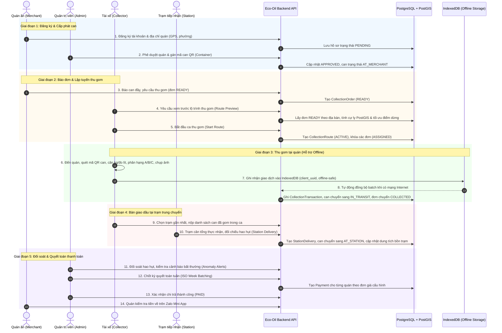
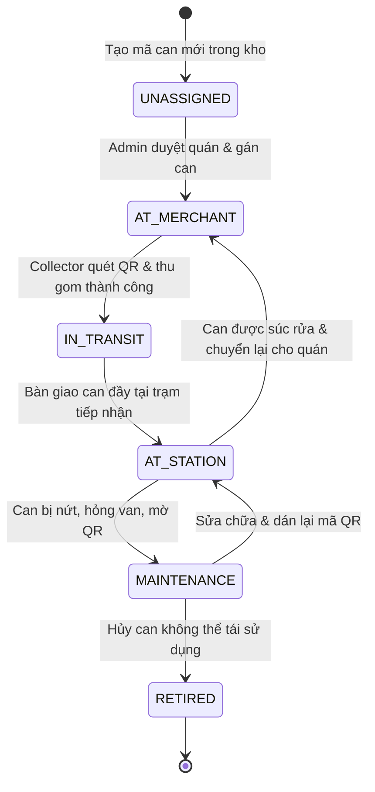
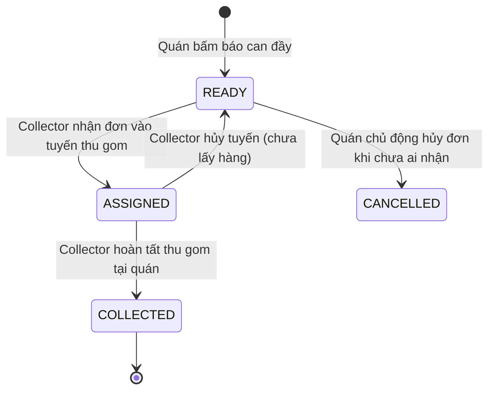
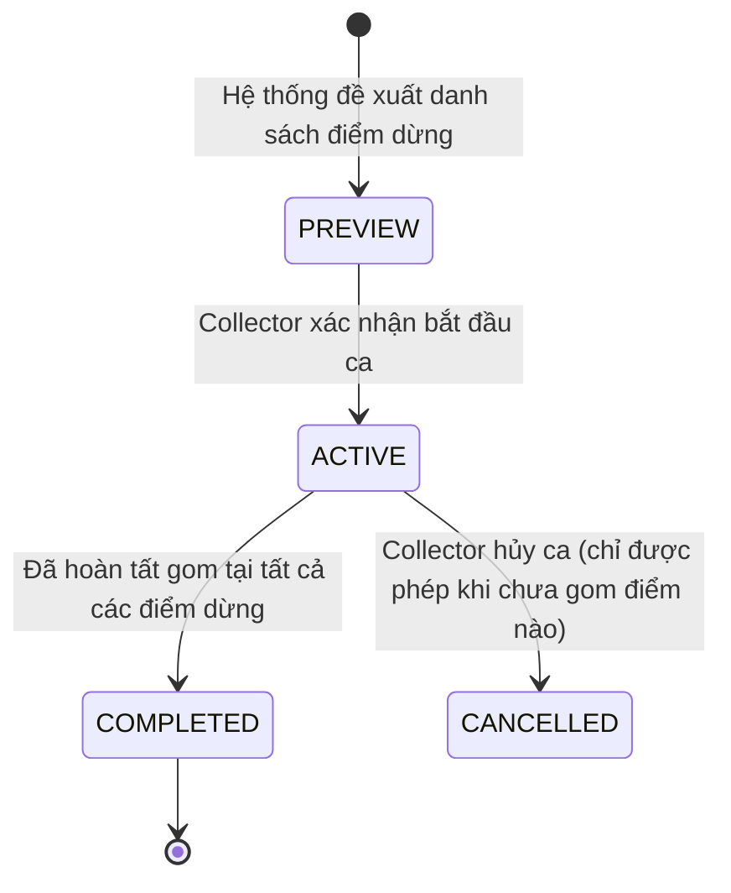
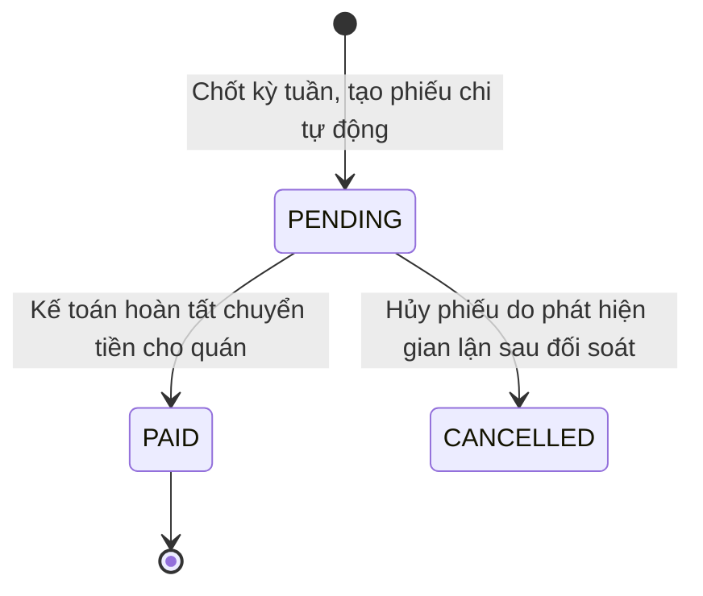

# Quy Trình Hoạt Động (Workflow) Toàn Diện Nền Tảng Eco-Oil UCO
## Hệ Thống Quản Lý Chuỗi Cung Ứng Thu Gom Dầu Ăn Đã Qua Sử Dụng

---

## 1. Sơ Đồ Quy Trình Tổng Thể (End-to-End Workflow)

Quy trình vận hành khép kín của nền tảng Eco-Oil kết nối 4 bên tham gia qua 5 giai đoạn nghiệp vụ:

---

## 2. Chi Tiết 5 Giai Đoạn Vận Hành

### Giai đoạn 1: Onboarding & Cấp phát tài nguyên
1. **Quán đăng ký:** Chủ quán mở Zalo Mini App, cấp quyền số điện thoại và vị trí hiện tại. Nhập tên quán, tên người đại diện, số nhà, chọn Phường/Xã phụ trách.
2. **Kiểm tra địa giới:** Hệ thống đối chiếu tọa độ GPS xem có nằm trong vùng phủ sóng thu gom hay không.
3. **Admin xét duyệt:** Admin kiểm tra hồ sơ quán trên trang quản trị. Nếu hợp lệ:
   - Phê duyệt quán (`APPROVED`).
   - Xuất 1 can rỗng từ kho can chưa gán (`UNASSIGNED`), quét mã QR và gán vào quán (`AT_MERCHANT`). Can được vận chuyển đến đặt tại quán.

---

### Giai đoạn 2: Phát sinh yêu cầu & Lập tuyến thu gom
1. **Quán báo đơn:** Khi lượng dầu chiên tích trữ gần đầy can, quán mở app bấm **"Yêu cầu thu gom"**, nhập số lít ước tính. Đơn hàng chuyển sang trạng thái `READY`.
2. **Lập tuyến (Route Planning):** 
   - Tài xế (Collector) mở ca làm việc trên app. Hệ thống truy vấn toàn bộ các đơn `READY` thuộc các phường mà tài xế được chỉ định.
   - Thuật toán AI Heuristic xếp lịch tuyến đường:
     - Lọc các quán có độ ưu tiên cao (can đầy, chờ nhiều ngày).
     - Kiểm tra tổng dung tích dự báo so với tải trọng thùng xe (chặn quá tải xe).
     - Sắp xếp thứ tự các điểm dừng theo lộ trình ngắn nhất.
3. **Bắt đầu ca (`Start Route`):** Collector bấm "Bắt đầu ca thu gom". Hệ thống chạy transaction khóa các đơn hàng sang `ASSIGNED`, ngăn không cho collector khác nhận trùng.

---

### Giai đoạn 3: Thu gom hiện trường & Đồng bộ ngoại tuyến (Offline-First)
1. **Tại hiện trường:** Collector đến quán, thực hiện quy trình kiểm định 4 bước:
   - **Quét QR:** Quét mã QR in trên thân can để đảm bảo lấy đúng can đã đăng ký của quán.
   - **Cân / Đo:** Đặt can lên cân điện tử lấy số kg (hoặc đo theo vạch lít). Hệ thống tự quy đổi tương ứng với hệ số tỷ trọng $0.91 \text{ kg/lít}$.
   - **Phân hạng chất lượng:** Chụp ảnh dầu. Module heuristic phân tích màu sắc, độ trong, cặn lắng để gợi ý hạng A/B/C. Collector xác nhận hạng dầu và đánh dấu nếu nghi ngờ có pha nước hoặc mỡ bẩn.
   - **Chụp ảnh bằng chứng & Lưu vị trí:** Chụp can dầu tại hiện trường (nén trực tiếp về 1280px) và lấy tọa độ GPS của điện thoại.
2. **Lưu trữ Offline (IndexedDB):**
   - Dữ liệu thu gom được lưu ngay lập tức vào cơ sở dữ liệu IndexedDB trên thiết bị người dùng với trạng thái `sync_status: 'pending'`.
   - Mỗi giao dịch được gán một mã `client_uuid` duy nhất. Tài xế có thể tiếp tục thu gom các quán tiếp theo dù mất sóng hoàn toàn.
3. **Đồng bộ tự động (Outbox Sync):**
   - Ngay khi máy có kết nối Internet trở lại (hoặc qua chu kỳ kiểm tra 30 giây), tiến trình đồng bộ ngầm gửi dữ liệu theo batch lên `/api/v1/sync/batch`.
   - Backend sử dụng câu lệnh `INSERT ... ON CONFLICT (client_uuid) DO NOTHING` để đảm bảo dù gửi lại nhiều lần cũng không bị trùng lặp giao dịch (Idempotency).
   - Sau khi ghi nhận thành công: Đơn hàng chuyển sang `COLLECTED`, can dầu chuyển sang trạng thái đang vận chuyển trên đường (`IN_TRANSIT`).

---

### Giai đoạn 4: Bàn giao tại trạm trung chuyển (Station Delivery)
1. **Chọn trạm bàn giao:** Kết thúc ca gom, collector mở danh sách trạm được hệ thống gợi ý (dựa trên khoảng cách gần nhất và dung tích bồn còn trống).
2. **Nộp can & Bàn giao:** 
   - Collector chọn các giao dịch đã thu gom trong ca muốn nộp vào trạm.
   - Trưởng trạm tiếp nhận các can dầu, đưa lên cân tổng của trạm để ghi nhận khối lượng thực tế nhập bồn.
3. **Kiểm tra sai lệch (Variance Check):**
   - Hệ thống tính độ sai lệch giữa tổng số đo collector gom tại các quán so với số đo thực tế trạm cân:
     $$\Delta = |\text{Tổng gom lẻ} - \text{Tổng trạm nhận}|$$
   - Nếu sai lệch vượt ngưỡng $2\%$, hệ thống tự động sinh cảnh báo `DELIVERY_VARIANCE_WARNING` để Admin vào điều tra (nghi ngờ rơi vãi hoặc tài xế bớt xén).
4. **Cập nhật kho:** Các can dầu chuyển sang trạng thái lưu kho trạm (`AT_STATION`), bồn trạm tăng thể tích lưu trữ tương ứng. Can rỗng sạch được bàn giao lại cho collector để luân chuyển vòng tiếp theo.

---

### Giai đoạn 5: Giám sát, Đối soát & Thanh toán
1. **Phát hiện bất thường (Anomaly Detection):**
   - Hệ thống chạy thuật toán Robust Z-Score quét toàn bộ giao dịch mới:
     - Phát hiện tỷ trọng dầu bất thường (dấu hiệu pha nước hoặc tạp chất).
     - Phát hiện tọa độ thu gom lệch quá 500m so với tọa độ đăng ký của quán (nghi gom dầu trôi nổi bên ngoài rồi ghi nhận vào quán).
   - Admin xem xét các cảnh báo và xác nhận phản hồi (`CONFIRMED_ANOMALY` hoặc `FALSE_POSITIVE`).
2. **Đối soát giao dịch (Reconciliation):**
   - Bộ phận vận hành so khớp giữa dữ liệu thu gom lẻ và phiếu giao trạm.
   - Xuất file báo cáo tổng hợp (CSV) phục vụ kiểm toán và tính thuế/chứng chỉ xanh.
3. **Lập bảng thanh toán (Weekly Payment Settlement):**
   - Định kỳ hàng tuần (theo chuẩn ISO Week), hệ thống quét toàn bộ các giao dịch hợp lệ đạt chuẩn (`PASS`).
   - Áp dụng biểu giá dầu đang có hiệu lực theo thời gian để tính số tiền chi trả cho từng quán ăn:
     $$\text{Thành tiền} = \text{Số lượng (lít/kg)} \times \text{Đơn giá}$$
   - Tạo phiếu thanh toán `Payment` ở trạng thái `PENDING`.
4. **Chi trả & Hoàn tất:** Kế toán chuyển khoản cho quán và chuyển trạng thái sang `PAID`. Chủ quán nhận được thông báo chi tiết trên Zalo Mini App.

---

## 3. Sơ Đồ Chuyển Đổi Trạng Thái Các Thực Thể (State Machines)

### 3.1. Vòng đời Can Dầu (`ContainerState`)
Vòng đời can dầu là mắt xích cốt lõi để bảo đảm tính truy xuất nguồn gốc:

---

### 3.2. Vòng đời Đơn Thu Gom (`OrderStatus`)

---

### 3.3. Vòng đời Ca Thu Gom (`RouteStatus`)

---

### 3.4. Vòng đời Thanh Toán (`PaymentStatus`)

---

## 4. Các Cơ Chế An Toàn & Toàn Vẹn Dữ Liệu

| Cơ chế kỹ thuật | Vấn đề giải quyết | Cách thức thực thi trong mã nguồn |
|---|---|---|
| **Idempotency qua `client_uuid`** | Mất mạng làm tài xế bấm gửi nhiều lần dẫn đến ghi nhận trùng 2 lần tiền/dầu | Mỗi bản ghi sinh UUIDv4 từ client. Backend dùng `ON CONFLICT (client_uuid) DO NOTHING`. |
| **Khóa bi quan (`FOR UPDATE`)** | Hai collector cùng nhận 1 đơn hàng hoặc giao trạm cùng lúc | Sử dụng `prisma.$queryRaw` với `SELECT ... FOR UPDATE` trong transaction khi tạo ca và nộp trạm. |
| **Offline-first Outbox** | Vùng lõm sóng di động tại các ngõ hẻm hoặc tầng hầm nhà hàng | Toàn bộ payload lưu vào Dexie.js (IndexedDB). Background worker retry lũy tiến có jitter. |
| **Xác thực mã hóa Zalo OAuth v4** | Tránh tấn công giả mạo danh tính (CSRF, Man-in-the-middle) | Sử dụng chuẩn PKCE (`code_challenge`) kết hợp state mã hóa thuật toán quân sự `AES-256-GCM`. |
| **Cảnh báo lệch GPS** | Thu gom dầu trôi nổi không rõ nguồn gốc | Đo khoảng cách PostGIS (`ST_Distance`) giữa tọa độ lúc quét QR và tọa độ quán, ngưỡng cảnh báo 500m. |
| **Giám sát tồn bồn quá hạn** | Dầu lưu kho lâu ngày bị tăng chỉ số axit (FFA), hỏng chất lượng | Tự động tính `storageAgeDays` dựa vào mẻ dầu đầu tiên nhập trạm, cảnh báo sau 10 và 14 ngày. |
